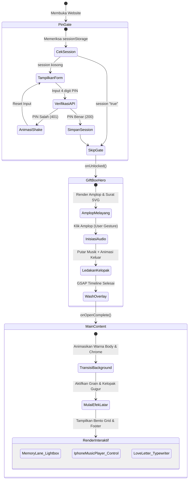
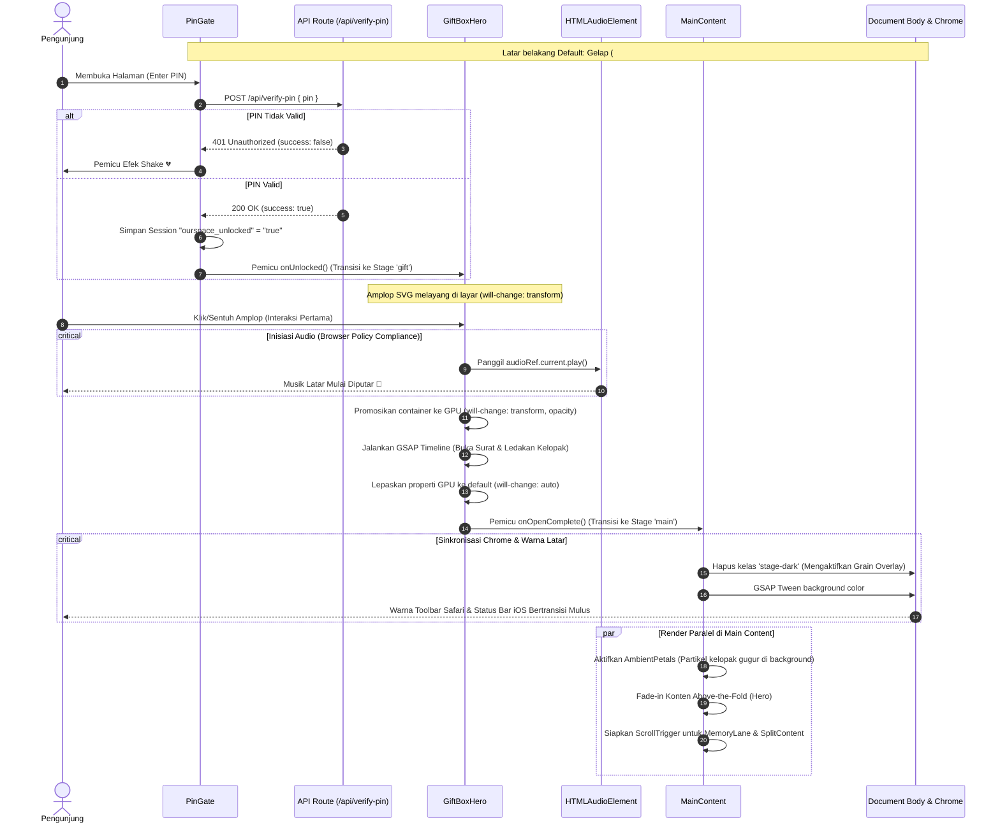

<div align="center">
  
  <h1 align="center">Our Space</h1>
  <p align="center"><strong>Premium Interactive Greeting & Memorial Narrative Hub</strong></p>
  
  <p align="center">
    
    
    
    
    
  </p>
</div>

---

**Our Space** adalah platform web ucapan (*interactive greeting website*) berkinerja tinggi yang menggabungkan estetika desain premium dengan narasi visual yang interaktif. Dibangun menggunakan teknologi modern seperti **Next.js (App Router)**, **React 19**, **TypeScript**, **Tailwind CSS v4**, dan **GSAP**, website ini menyajikan transisi yang halus, efek audio terintegrasi, serta dekorasi visual kelopak bunga yang memukau untuk mengabadikan momen spesial Anda.

Aplikasi ini dapat dikustomisasi secara penuh untuk berbagai kebutuhan acara:
- **Anniversary Hubungan**: Mengenang perjalanan cinta dan merayakan hari jadian bersama pasangan.
- **Ulang Tahun Orang Spesial**: Hadiah digital interaktif yang dilengkapi dengan album kenangan eksklusif.
- **Selamat Wisuda**: Apresiasi pencapaian akademis pasangan atau sahabat terdekat.
- **Pernikahan / Pertunangan**: Kirim ucapan selamat menempuh hidup baru dengan format yang elegan dan modern.

---

## 🎨 Keunggulan Desain & Pengalaman Pengguna

- **Estetika Visual Premium & Lembut**: Menggunakan palet warna harmonis (kombinasi *Rose Gold*, *Blush Pink*, *Peach*, dan *Dark Mahogany*) dengan grain overlay mewah serta elemen bunga sakura/sepatu (*hibiscus*) dekoratif yang responsif.
- **Transisi 3-Stage yang Buttery-Smooth**: Mengeliminasi efek *layout shift* atau *visual flash* selama navigasi alur masuk berkat pengaturan koordinasi timeline **GSAP**.
- **Sinkronisasi Warna Body & Chrome iOS**: Latar belakang elemen `html` dan `body` disesuaikan secara real-time per stage untuk menghindari perbedaan warna status bar/toolbar pada Safari iOS dan mode PWA.
- **Interaksi Audio-Visual Imersif**: Musik latar berformat MP3 terintegrasi secara otomatis setelah interaksi pertama pengguna, berkolaborasi dengan pemutar musik visual bergaya **iPhone Apple Music Now Playing** lengkap dengan detail earphone kabel dekoratif.
- **Aksesibilitas & Kepatuhan Standar**: Sepenuhnya menghormati preferensi sistem pengguna seperti `prefers-reduced-motion` dan mendukung navigasi keyboard lengkap (`Enter`, `Space`, dan `Escape`).

---

## 🪜 Arsitektur Alur & Navigasi (Narrative Flow Architecture)

Aplikasi ini menggunakan sistem transisi 3 fase terkoordinasi untuk memandu emosi pengunjung dari rasa penasaran hingga kebahagiaan. Untuk mempermudah analisis alur sistem, dokumentasi dibagi menjadi dua diagram teknis di bawah ini:

### 1. Diagram Transisi Status (State Transition Diagram)
Diagram ini menjelaskan bagaimana status halaman (`AppStage = "pin" | "gift" | "main"`) berubah berdasarkan interaksi pengguna dan pemeriksaan penyimpanan sesi (*session storage*):



### 2. Diagram Urutan Interaksi & Rendering (Detailed Sequence Diagram)
Diagram ini merinci urutan panggilan API, kepatuhan kebijakan audio browser, alokasi memori GPU (`will-change`), serta efek transisi warna latar belakang pada browser mobile secara sinkron:



---

### 📂 Struktur Repositori & Pemisahan Komponen

Arsitektur kode di dalam direktori `src/components/` diimplementasikan secara modular untuk memudahkan pemeliharaan jangka panjang:

| Komponen / Berkas | Deskripsi & Tanggung Jawab |
| :--- | :--- |
| 🛡️ **[PinGate.tsx](./src/components/PinGate.tsx)** | Halaman gerbang verifikasi PIN. Menggunakan *single invisible overlay input* di atas visual boxes untuk meminimalkan kegagalan fokus keyboard dan *auto-zoom* browser mobile. |
| ✉️ **[GiftBoxHero.tsx](./src/components/GiftBoxHero.tsx)** | Animasi amplop & surat pembuka SVG, efek *wash overlay*, inisiasi audio track, dan GPU layer promotion selama transisi berjalan. |
| 🌸 **[FloralDecor.tsx](./src/components/FloralDecor.tsx)** | Dekorasi bunga latar belakang SVG statis yang diatur dengan `pointer-events-none` dan `aria-hidden="true"`. |
| 🍂 **[AmbientPetals.tsx](./src/components/AmbientPetals.tsx)** | Partikel kelopak bunga melayang acak di latar belakang yang berjalan secara asinkron menggunakan GSAP/ScrollTrigger. |
| 📸 **[MemoryLane.tsx](./src/components/MemoryLane.tsx)** | Layout bento grid kartu polaroid yang terintegrasi dengan lightbox foto kenangan interaktif berkategori dialog. |
| 🃏 **[PolaroidCard.tsx](./src/components/PolaroidCard.tsx)** | Kartu polaroid fisik lengkap dengan stiker daun/bunga yang mendukung navigasi keyboard (`Enter`/`Space`). |
| 🌿 **[SplitContent.tsx](./src/components/SplitContent.tsx)** | Garis waktu pencapaian (*milestones timeline*) dengan visual buket bunga SVG. |
| 📁 **[MusicLetterFooter.tsx](./src/components/MusicLetterFooter.tsx)** | Layout penampung komponen pemutar musik dan surat cinta secara berdampingan. |
| 🎵 **[IphoneMusicPlayer.tsx](./src/components/IphoneMusicPlayer.tsx)** | Pemutar media interaktif berestetika *Apple Music Now Playing* pada iPhone lengkap dengan kabel earphone dekoratif. |
| ✍️ **[LoveLetter.tsx](./src/components/LoveLetter.tsx)** | Surat cinta romantis dengan animasi pengetikan per karakter (*typewriter effect*) yang mengalir secara organik. |
| 🎨 **[globals.css](./src/app/globals.css)** | Konfigurasi tema global, keyframes kustom, serta pengaturan Tailwind CSS v4 `@theme inline`. |
| 🧱 **[layout.tsx](./src/app/layout.tsx)** | Tata letak dasar aplikasi, pemuatan font Google (`Geist`, `Geist Mono`, `Dancing Script`), dan meta tag PWA. |
| 🚀 **[page.tsx](./src/app/page.tsx)** | Titik masuk halaman utama, pengaturan stage state, audio controller, dan inisiasi ScrollTrigger. |
| ⚙️ **[galleryConfig.ts](./src/config/galleryConfig.ts)** | Berkas konfigurasi terpusat untuk kustomisasi aset foto polaroid (`MEMORIES`, `HERO_POLAROID`) dan file serta metadata pemutar musik (`SONG_SRC`, `SONG_META`). |
| ⚙️ **[textConfig.ts](./src/config/textConfig.ts)** | Berkas konfigurasi terpusat untuk seluruh konten teks aplikasi (PIN gate, gift box, hero teks, chapters milestone, love letter, playlist hints). |

---

## 🛠️ Instalasi & Pengembangan Lokal

Ikuti langkah-langkah di bawah ini untuk menjalankan repositori secara lokal di mesin Anda:

1. **Clone Repositori**:
   ```bash
   git clone https://github.com/username/ourspace-us.git
   cd ourspace-us
   ```

2. **Instalasi Dependensi**:
   ```bash
   npm install
   # atau menggunakan pnpm / yarn
   pnpm install
   ```

3. **Duplikasi Berkas Environment**:
   Salin file [`.env.example`](./.env.example) menjadi `.env.local`:
   ```bash
   cp .env.example .env.local
   ```

4. **Konfigurasi Variabel Environment**:
   Buka berkas `.env.local` lalu isi nilai yang sesuai:
   - `PIN_CODE`: Kode sandi 4 digit untuk membuka website (default: `0614`).
   - `CLOUDINARY_IMAGE_*`: Tautan gambar kustom (dapat merujuk ke layanan CDN seperti Cloudinary, Unsplash, Imgur, atau menggunakan berkas lokal `/images/nama-file.jpg` di dalam folder `/public`).

5. **Jalankan Server Development**:
   ```bash
   npm run dev
   ```
   Buka [http://localhost:3000](http://localhost:3000) pada peramban Anda untuk melihat hasilnya.

---

## 🎨 Panduan Kustomisasi Ucapan (Skenario Khusus)

Platform ini dirancang agar mudah digunakan kembali untuk berbagai acara dengan memisahkan konfigurasi menjadi berkas media (`galleryConfig.ts`) dan berkas teks (`textConfig.ts`). Anda dapat mengadaptasi skenario berikut:

### 1. 🎂 Skenario Ulang Tahun (Birthday Wishes)
- **PIN Gate Hint**: Buka berkas [textConfig.ts](./src/config/textConfig.ts) dan ubah nilai `CONFIG_PINGATE.pinHint` menjadi _"Tanggal ulang tahun orang tersayang 🎂"_.
- **Konfigurasi Teks**: Ubah teks ucapan di berkas [textConfig.ts](./src/config/textConfig.ts) (misalnya judul utama `CONFIG_PAGE.heroTitleHighlight` dan paragraf `CONFIG_LOVELETTER.paragraphs`).
- **Media Album**: Konfigurasikan foto-foto kenangan di [galleryConfig.ts](./src/config/galleryConfig.ts) pada variabel `MEMORIES` dan `HERO_POLAROID`.

### 2. 🎓 Skenario Kelulusan / Wisuda (Graduation Celebration)
- **PIN Gate Hint**: Buka berkas [textConfig.ts](./src/config/textConfig.ts) dan sesuaikan `CONFIG_PINGATE.pinHint` menjadi _"Tanggal sidang skripsi atau kelulusanmu 🎓"_.
- **Milestones**: Ubah teks pencapaian di [textConfig.ts](./src/config/textConfig.ts) pada `CONFIG_MILESTONES.cards` untuk menceritakan kisah perjalanan kuliah, dan sesuaikan fotonya di [galleryConfig.ts](./src/config/galleryConfig.ts).
- **Pesan Surat**: Tulis pesan apresiasi kelulusan di [textConfig.ts](./src/config/textConfig.ts) pada variabel `CONFIG_LOVELETTER.paragraphs`.

### 👰 Skenario Pernikahan / Lamaran (Wedding & Engagement)
- **PIN Gate Hint**: Buka berkas [textConfig.ts](./src/config/textConfig.ts) dan sesuaikan `CONFIG_PINGATE.pinHint` menjadi _"Tanggal pernikahan atau janji suci kita 💍"_.
- **Tema Warna**: Sesuaikan variabel warna utama di [globals.css](./src/app/globals.css) agar menyatu dengan palet warna pernikahan (seperti Ivory, Champagne Gold, atau Classic White).
- **Lagu Latar**: Ganti track lagu romantis pernikahan di `/public/music/` dan sinkronisasikan pada `SONG_SRC` di berkas [galleryConfig.ts](./src/config/galleryConfig.ts).

---

## ⚡ Rekayasa Animasi & Performa GPU

Proyek ini menerapkan optimasi performa tingkat tinggi agar visual yang kaya tetap berjalan lancar tanpa penurunan frame-rate (_frame drop_), terutama pada perangkat mobile:

1. **GSAP & @gsap/react Lifecycle**:
   Seluruh siklus hidup timeline animasi dikelola menggunakan hook `useGSAP` untuk menghindari kebocoran memori (_memory leak_). Timelines dan listeners secara otomatis di-clean up saat komponen melakukan unmount.
2. **GPU Layer Promotion & Cleanup (`will-change`)**:
   Untuk mempercepat rendering transisi amplop berat di [GiftBoxHero.tsx](./src/components/GiftBoxHero.tsx), elemen yang bergerak dipromosikan sementara ke GPU menggunakan properti CSS `will-change: transform, opacity`. Setelah animasi selesai, properti tersebut dikembalikan ke `auto` melalui callback `onComplete` untuk membebaskan alokasi memori GPU.
3. **Optimasi Rendering Komposit (Grain Overlay)**:
   Selama transisi animasi partikel berjalan pada stage gelap (`pin` & `gift`), kelas `stage-dark` ditambahkan pada `body`. Kelas ini menyembunyikan grain overlay secara global (`body::after { display: none }`) untuk mengurangi beban _composite pass_ layar penuh pada browser.
4. **Asynchronous Image Decoding**:
   Gambar pendukung dan partikel kelopak bunga yang melayang dalam jumlah banyak menggunakan atribut `decoding="async"` pada elemen `` untuk mencegah pemblokiran thread utama rendering browser saat gambar sedang didekode.
5. **Above-the-Fold Animation Limit**:
   Animasi transisi awal dibatasi hanya pada elemen di atas lipatan layar (_above-the-fold_) untuk menjaga kestabilan Core Web Vitals (khususnya LCP dan CLS) saat halaman baru selesai dimuat.

---

## ♿ Aksesibilitas (a11y) & Kompatibilitas Mobile

- **Dukungan Reduced Motion**: Mendeteksi konfigurasi sistem pengguna `window.matchMedia("(prefers-reduced-motion: reduce)").matches`. Jika aktif, transisi akan diubah menjadi durasi instan (0.4s - 0.5s) dan meniadakan efek stagger.
- **Navigasi Keyboard Lengkap**: Mendukung interaksi penuh tanpa mouse menggunakan keyboard (`Enter`/`Space` untuk klik, `Escape` untuk menutup dialog lightbox foto).
- **Notch & PWA Safari iOS Edge-to-Edge**:
  Mengintegrasikan konfigurasi Apple Web App Capable (`capable: true`, `statusBarStyle: "black-translucent"`) pada metadata Next.js untuk mencegah antarmuka terpotong oleh lekukan notch pada perangkat Apple saat dipasang sebagai PWA.

---

## 🎀 Sentuhan Estetika & Kreator

Proyek ini dirancang dan dibangun oleh seorang **kreator perempuan** yang percaya bahwa teknologi tidak hanya harus bekerja secara andal, tetapi juga mampu menyampaikan emosi yang hangat.

Setiap elemen—mulai dari transisi kelopak bunga yang melayang lembut, sinkronisasi warna latar belakang chrome Safari, hingga sudut kartu polaroid yang dihiasi stiker bunga kertas—dirancang secara manual dengan presisi tinggi. Ini merupakan perpaduan antara **rekayasa perangkat lunak modern** yang kokoh dan **sentuhan estetika visual feminin yang lembut**.

---

<div align="center">
  <p>© 2026 Sure & Adun. All rights reserved.</p>
  <p><em>Crafted with love, dedication, and a touch of aesthetic magic by a female engineer. 🌸✨</em></p>
</div>
